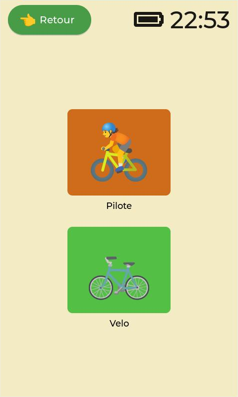

# OpenBikeComputer core application

## Description

The openbikecomputer-core application in the main application of the openbikecomputer project. \
The application is mainly written in C, the UI is done using LVGL.

## Screenshot
<p float="center">
  
  
</p>

## Dependency
- libwayland-client
- libwayland-cursor
- libxkbcommon
- libconfig
- lvgl (v9.1)

## Build
```
make
```

## License

The application is released under GPL-V3 terms. \
See [LICENSE](./LICENSE) for more details.
